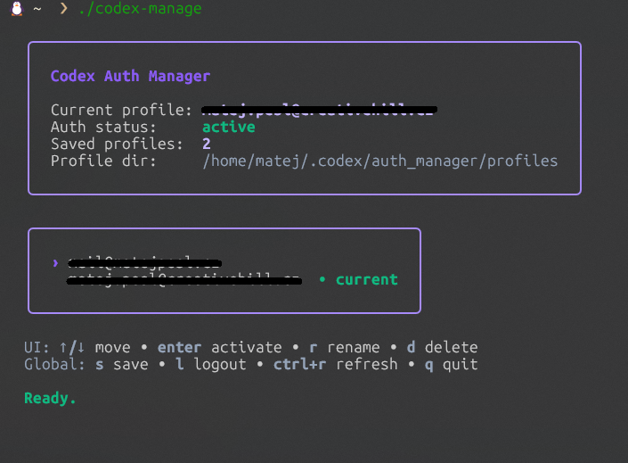

# codex-manage

`codex-manage` is a small terminal UI for switching between multiple Codex auth profiles on the fly.



It keeps saved profiles next to your local Codex config (`~/.codex/auth.json` on Linux/macOS, `%USERPROFILE%\.codex\auth.json` on Windows) and lets you quickly:

- save the current auth file as a named profile
- activate another saved profile
- rename or delete saved profiles
- log out by removing the active `auth.json`

This is useful if you regularly work with multiple Codex accounts and want a faster way to swap between them without logging out/in constantly or manually copying auth files around.

## Build

```sh
make build
```

This produces a binary named `codex-manage` (or `codex-manage.exe` on Windows) in the `dist/` directory.

You can also build directly with Go:

```sh
go build -o dist/ ./cmd/codex-manage
```

## Release

Create and push a release tag with (PowerShell):

```powershell
./release.ps1 v0.1.0
```

That script runs tests, creates an annotated git tag, and pushes it to `origin`. GitHub Actions then builds release archives for Linux, macOS, and Windows, publishes a GitHub release, and includes the commits since the previous tag in the release notes.

## Run

```sh
./dist/codex-manage
```

(Or `./dist/codex-manage.exe` on Windows)
